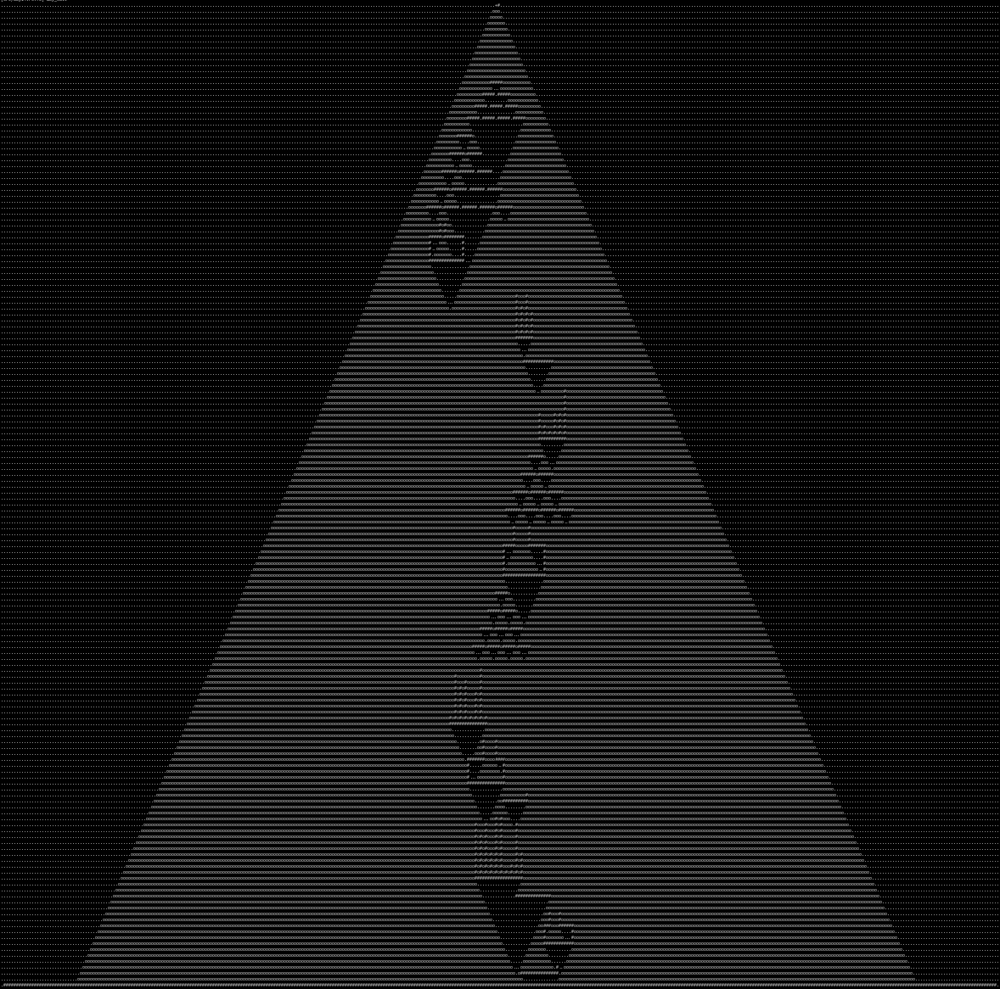

This repository contains my solutions to Advent of Code 2022.
I'm starting it in Rust, let's see how it goes!

# Usage

`cargo <day> <part> <input_file>`

For instance: `cargo run 1 2 inputs/day1_input` to output solution for day1, part2.

Here is a nice image of day 14 result for my input 
